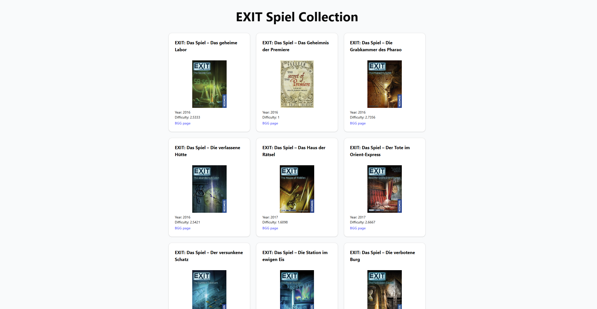

# EXIT Spiel Collection

A **React + Vite + TypeScript** app to manage and explore **EXIT: Das Spiel** board games.  
Features include filtering by difficulty, sorting by title/year/difficulty, and linking to BoardGameGeek pages.
[Try it out now!](https://exit-game.nandoerni.com/)



## Features

- ✅ Dark Mode!!
- ✅ Display all EXIT games in German with cover images
- ✅ Show year published and BGG difficulty (average weight)
- ✅ Show detailed infos about a specific game
- ✅ Responsive grid layout with TailwindCSS
- ✅ Components powered by [shadcn/ui](https://ui.shadcn.com)

## Tech Stack

- [React 18](https://reactjs.org/)
- [Vite](https://vitejs.dev/) (React + TypeScript)
- [TypeScript](https://www.typescriptlang.org/)
- [TailwindCSS](https://tailwindcss.com/)
- [shadcn/ui](https://ui.shadcn.com) (prebuilt UI components)
- [BoardGameGeek XML API](./src/data/games.json) (scraped via Node.js)

## Installation

1. Clone the repo:

```bash
git clone https://github.com/your-username/exit-games-app.git
cd exit-games-app
```

2. Install dependencies:

```bash
npm install
```

3. Run the development server:

```bash
npm run dev
```


## Node.js scraper (`/fetch-exit-game-data/`)

To avoid repeatedly hitting the BoardGameGeek API and save bandwidth, the **list of current EXIT games** is generated using a **separate Node.js script**:

- Location: `/fetch-exit-game-data/`
- Output: `games.json` in `src/data/`
- Function: Fetches all current EXIT games from BGG, extracts German titles, images, difficulty, and links.

### How to update `games.json`

1. Navigate to the scraper folder:

```bash
cd fetch-exit-game-data
```
2. Install dependencies:

```bash
npm install
```

3. Run the script:

```bash
npm fetch-exit-games.js
```

4. Copy the generated `games.json` to the React app
```bash
cp games.json ../src/data/games.json
```
