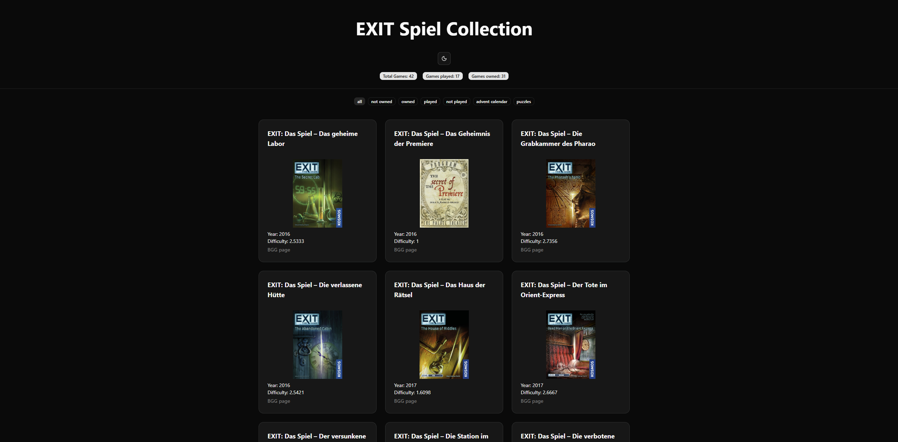

# EXIT Spiel Collection

A **React + Vite + TypeScript** app to manage and explore **EXIT: Das Spiel** board games.  
Features include filtering by difficulty, sorting by title/year/difficulty, and linking to BoardGameGeek pages.



## Features

- ✅ Display all EXIT games in German with cover images
- ✅ Show year published and BGG difficulty (average weight)
- ✅ Filter by minimum difficulty
- ✅ Sort by title, year, or difficulty (ascending/descending)
- ✅ Responsive grid layout with TailwindCSS
- ✅ Components powered by [shadcn/ui](https://ui.shadcn.com)

## Tech Stack

- [React 18](https://reactjs.org/)
- [Vite](https://vitejs.dev/) (React + TypeScript)
- [TypeScript](https://www.typescriptlang.org/)
- [TailwindCSS](https://tailwindcss.com/)
- [shadcn/ui](https://ui.shadcn.com) (prebuilt UI components)
- [BoardGameGeek JSON](./src/data/games.json) (scraped via Node.js)

## Installation

1. Clone the repo:

```bash
git clone https://github.com/your-username/exit-games-app.git
cd exit-games-app
```

2. Install dependencies:

```bash
npm install
```

3. Run the development server:

```bash
npm run dev
```


## Project Structure
```bash
src/
 ├─ components/       # Reusable UI components (Cards, Buttons)
 │    └─ GameCard.tsx
 ├─ data/             # Pre-scraped games JSON
 │    └─ games.json
 ├─ App.tsx           # Main app with filter & sort logic
 └─ main.tsx          # React DOM entry

```
